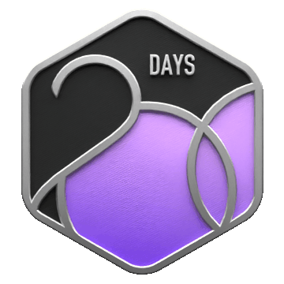
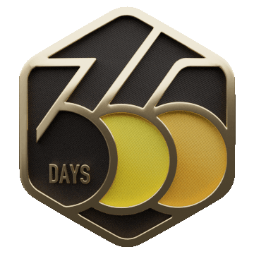

<h1 align="left" style="color:white;" >Hey 👋 What's up?</h1>

My name is Prince, and I work as a Software Developer. 🚀 Currently, I'm pursuing a degree in Computer Science & Technology 📚, and I have a strong passion for Full Stack Software Development, Artificial Intelligence, Machine Learning, Data Science, and Blockchain. 💙 Right now, I'm actively involved in creating software and applications using different tools. If you're interested, you can check out my portfolio on GitHub! 📱👀

- 🔭 I’m currently working on Community Projects

- 🌱 I’m currently learning Artificial Intelligence and Machine Learning.

- 👯 I’m looking to collaborate on Software Development and Open Source Projects, and New Ideas.

- 💬 Talk to me about DSA - Problem Solving, Generative AI, Blockchain, Freelancing Opportunities and Open Source Projects.

<h2 align="left" style="color:white;" >💻 Tech Stack </h2>

### 🌐 Programming Languages
       

### ⚛️ Web Frameworks
       

### 🛠️ Backend & Databases
        

### 🤖 AI, Machine Learning & Data Science
     

### ☁️ Cloud & DevOps
         

### 🧰 Developer Tools & Workflow
      

<h2 align="left" style="color:white;" >🌐 My socials</h2>

## 📊 GitHub Stats

  
  
  

    
  

## 🏆 GitHub Trophies

  

## Check Out My Work 

### My Portfolio Website: [Portfolio 🔗](http://www.alfaceti.me/)

## ✍️ Random Dev Quote

<h2 align="center">Leetcode Info<h2>  

  
  
  
  
  
  
  
  

<h2 align="center" style="color:white;">🐍 Contribution Graph Snake</h2>

  <picture>
    <source media="(prefers-color-scheme: dark)" srcset="https://raw.githubusercontent.com/pkprajapati7402/pkprajapati7402/output/github-contribution-grid-snake-dark.svg" />
    <source media="(prefers-color-scheme: light)" srcset="https://raw.githubusercontent.com/pkprajapati7402/pkprajapati7402/output/github-contribution-grid-snake.svg" />
    
  </picture>

---

Thanks for stopping by! 😊
